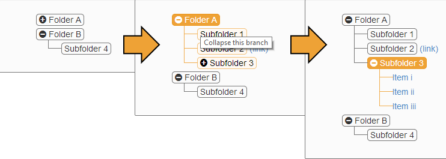

bootstrap-tree
==============

Based off of jhfrench's [bootstrap-tree](https://github.com/jhfrench/bootstrap-tree) with some slight modifications.

To use: compile the .less file into your css styles. Include the javascript on your page after loading bootstrap:

```html
<script src="https://ajax.googleapis.com/ajax/libs/jquery/1.11.1/jquery.min.js"></script>
<script src="js/bootstrap.min.js"></script>
<script src="js/bootstrap-tree.js"></script>
```

Call the bootstrapTree function on all elements you would like to convert to a tree view:
```html
<script>
	$(document).ready(function() {
	$('.tree').bootstrapTree();
	});
</script>
```

Markup the treeview using html:

```html
<div class="tree">
	<ul>
		<li>
			<span><i class="fa fa-plus-circle"></i> Folder A</span>
			<ul>
				<li><span>Subfolder 1</span></li>
				<li><span>Subfolder 2</span> <a href="#">(link)</a></li>
				<li><span><i class="fa fa-plus-circle"></i> Subfolder 3</span>
					<ul>
						<li><a href="#">Item i</a></li>
						<li><a href="#">Item ii</a></li>
						<li><a href="#">Item iii</a></li>
					</ul>
				</li>
			</ul>
		</li>
		<li>
			<span><i class="fa fa-minus-circle"></i> Folder B</span>
			<ul expanded>
				<li><span>Subfolder 4</span>
					<ul>
						<li><a href="#">Item iv</a></li>
					</ul>
				</li>
			</ul>
		</li>
	</ul>
</div>
```

Which will produce:




Note that the entire tree will start as collapsed. Use an `expanded` data-attribute on `ul` tags that you wish to start off expanded (non-collapsed).


Todo
----